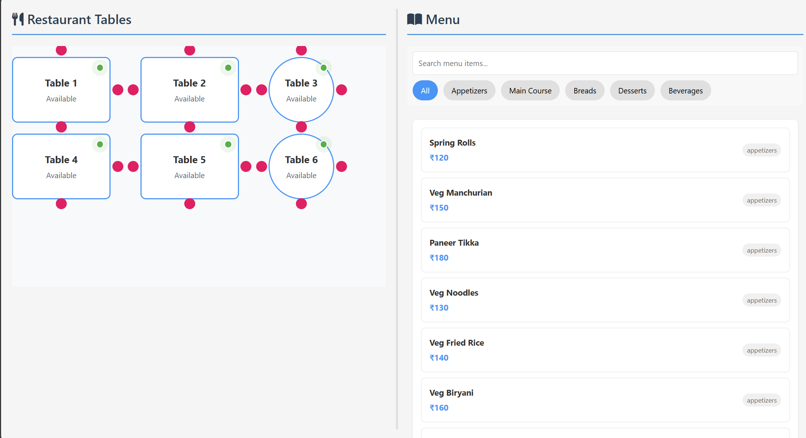
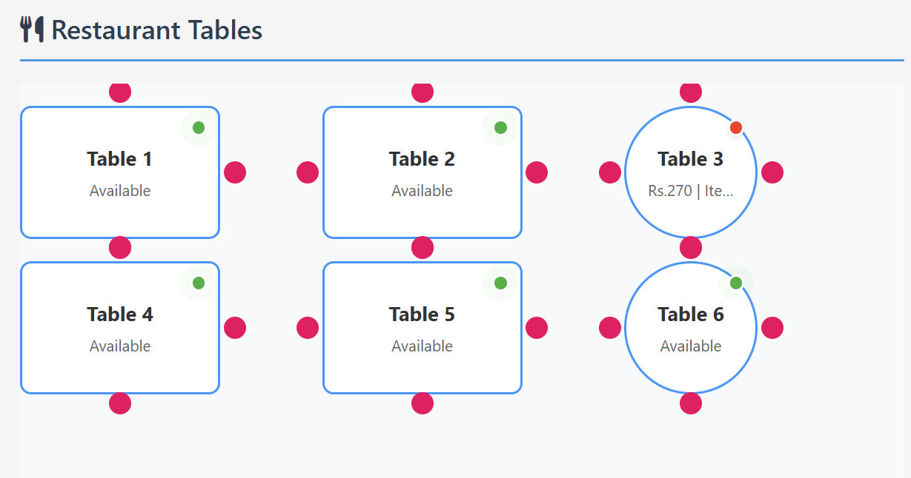
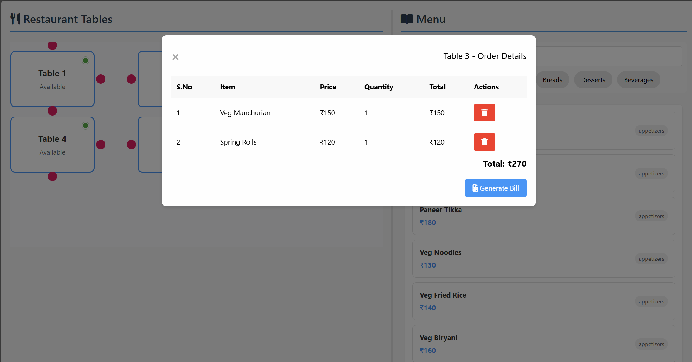

# Restaurant POS System

A modern, interactive Point of Sale (POS) system for restaurants with a beautiful UI and drag-and-drop functionality.

## Features

- 🍽️ **Interactive Menu Display**
  - Categorized menu items (Appetizers, Main Course, Breads, Desserts, Beverages)
  - Search functionality
  - Category filtering

- 🪑 **Table Management**
  - Visual table layout
  - Real-time table status updates
  - Drag-and-drop order placement
  - Table occupancy tracking

- 📝 **Order Management**
  - Easy order creation through drag-and-drop
  - Real-time order updates
  - Bill generation

- 💰 **Billing System**
  - Automatic bill calculation
  - Item-wise billing
  - Total amount calculation
  - Bill generation and printing

## Technologies Used

- HTML5
- CSS3
- JavaScript (ES6+)

## Screenshots

### Main Interface


*The main interface showing the restaurant layout and menu items*


### Table Management
image.png

*Interactive table layout with status indicators*

### Order and Bill


*interface to see placed orders and Bill generation with itemized details*


## Setup Instructions

1. **Prerequisites**
   - Node.js installed on your system
   - npm (Node Package Manager)

2. **Installation**
   ```bash
   # Install http-server globally
   npm install -g http-server
   ```

3. **Running the Application**
   ```bash
   # Start the server
   http-server -o
   ```
   The application will open automatically in your default browser at `http://localhost:8080`

## Project Structure

```
Restaurant-app/
├── index.html          # Main HTML file
├── styles.css          # CSS styles
├── app.js             # Main application logic
├── menuData.js        # Menu items data
└── tables.js          # Table configuration
```

## Usage Guide

1. **Viewing Menu**
   - All menu items are displayed by default
   - Use category buttons to filter items
   - Use search bar to find specific items

2. **Placing Orders**
   - Drag menu items to tables
   - Click on tables to view/modify orders
   - Add/remove items from orders
   - Generate bills when ready

3. **Table Management**
   - Tables show current status (Available/Occupied)
   - Click on tables to view details
   - Drag items to add to table orders

